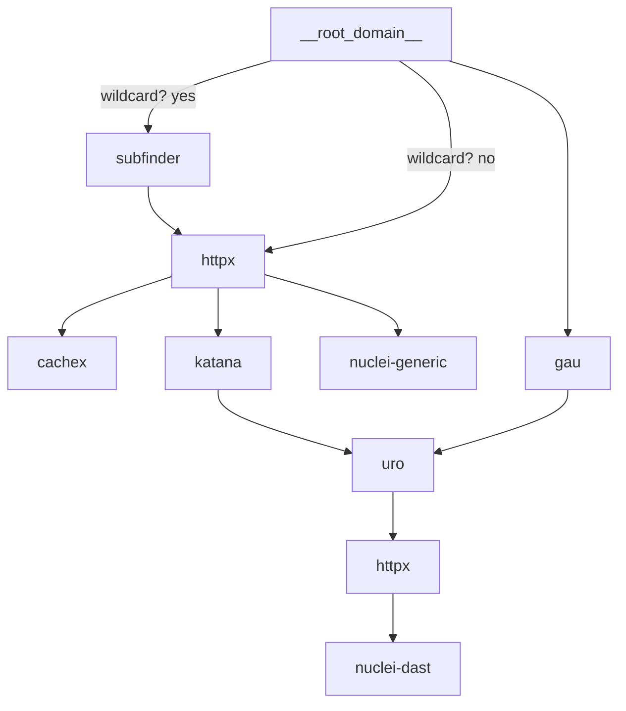

## Some context

This project is something I've been building in my spare time. If you simply want to try it out, head to the Releases section, download the latest version, and run it directly.

If you're on a different operating system or CPU Arch, install it using Go tool chain:

```console
go install github.com/ayuxsec/spike/cmd/spike@latest
```

You can email me at ayuxsec@proton.me if you need help with something or want to contribute.

## Flow Chart

see [pipeline.go](internal/pkg/scanner/core/pipeline.go)



## config

config example

```yaml
tools:                                 # Tool configuration
    httpx:
        threads: 25                    # Number of concurrent httpx workers
        ports_to_scan:                 # Ports to probe for web services
            http:
                - "80"                 # Standard HTTP
                - "8080"               # Alternate HTTP
                - "8000"               # Dev servers
                - "8008"               # Proxies / alt HTTP
                - "8888"               # Dashboards / dev tools
                - "3000"               # Node / frontend
                - "5000"               # Flask / APIs
                - "9000"               # Internal apps
                - "81"                 # Additional HTTP ports
                - "82"
                - "83"
                - "84"
                - "591"                # FileMaker web
                - "2082"               # cPanel HTTP
                - "2086"               # WHM HTTP
                - "2095"               # Webmail HTTP
                - "10000"              # Webmin HTTP
            https:
                - "443"                # Standard HTTPS
                - "8443"               # Admin panels / dashboards
                - "9443"               # Enterprise consoles
                - "5001"               # HTTPS APIs
                - "3001"               # HTTPS frontend
                - "8001"               # TLS dev servers
                - "8081"               # Alternate HTTPS
                - "2083"               # cPanel HTTPS
                - "2087"               # WHM HTTPS
                - "2096"               # Webmail HTTPS
                - "10001"              # Webmin HTTPS
                - "10443"              # Alternate TLS
                - "10444"              # Alternate TLS
        screenshot: false              # Capture screenshots of discovered pages
        cmd_timeout_in_second: 900     # Max execution time

    subfinder:
        threads: 10                   # Concurrent subfinder workers
        enabled: true                 # Enable subdomain discovery
        cmd_timeout_in_second: 900    # Max execution time

    katana:
        enabled: true                 # Enable crawling
        threads: 10                   # Concurrent crawling threads
        crawl_depth: 3                # Maximum crawl depth
        max_crawl_time: 10m           # Total crawl time limit
        parallelism_threads: 10       # Parallel browser workers
        headless: false               # Run browser in headless mode
        no_sandbox: false             # Disable browser sandbox
        cmd_timeout_in_second: 900    # Max execution time

    gau:
        enabled: true                 # Enable URL collection
        threads: 10                   # Concurrent workers
        cmd_timeout_in_second: 900    # Max execution time

    nuclei:
        threads: 25                   # Concurrent scan threads
        template_settings:
            generic: true             # Enable generic template set
            dast: true                # Enable DAST templates
            headless: false           # Run headless templates
        template_paths:
            generic:
                include:              # Template directories to include
                    - http/
                    - cloud/
                    - javascript/
                    - dns/
                    - ssl/
                    - network/
                    - http/cves/2024
                    - http/cves/2023
                    - http/cves/2022
                    - http/cves/2021
                    - http/cves/2020
                exclude:              # Template directories to exclude
                    - http/cves/
                exclude_severity:     # Templates to ignore by severity
                    - info
            dast:
                include:              # DAST template directories
                    - dast/
                exclude:              # Template directories to exclude
                    - ""
                exclude_severity:     #  Templates to ignore by severity
                    - info
        cmd_timeout_in_second: 900    # Max execution time

    cachex:
        enabled: true                 # Enable cache poisoning testing
        threads: 10                   # Concurrent workers
        cmd_timeout_in_second: 900    # Max execution time

reporter:                            # Reporting configuration
    telegram:
        enabled: false               # Enable Telegram notifications
        bot_token: ""                # Telegram bot token
        chat_id: 0                   # Target chat ID
        request_timeout: 10          # Telegram API timeout
```
